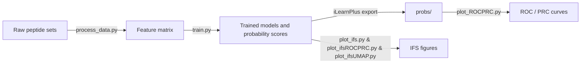

# Aegis
*An end-to-end pipeline for identifying anticancer peptides and visualising model performance.*

---

## Project Workflow



---

## Key Steps

| # | Stage | Script(s) | Description |
|---|-------|-----------|-------------|
| 1 | **Data preprocessing** | `process_data.py` | Cleans raw peptide files, merges labels, and produces a unified feature matrix for downstream modelling. |
| 2 | **Model training** | `train.py` | Trains traditional Transformer classifiers (see code for details) and saves per-sample probability scores. |
| 3 | **Probability export** | — | The saved files are fully compatible with **iLearnPlus** ≥ v0.1.4. |
| 4 | **Visualisation** | `plot_*.py` | Generates publication-ready plots:<br/>• `plot_ROCPRC.py` – ROC & PRC curves from iLearnPlus-style files.<br/>• `plot_ifs.py` – incremental-feature-selection (IFS) curves.<br/>• `plot_ifsROCPRC.py` – ROC/PRC of top-k IFS subsets.<br/>• `plot_ifsUMAP.py` – UMAP embedding coloured by class. |

---

## Quick Start

> **Prerequisites**  
> Python ≥ 3.9 &nbsp;|&nbsp; pip ≥ 23.0  

```bash
# 1️⃣  Pre-process raw data
python process_data.py

# 2️⃣  Train models & save probability scores
python train.py          

# 3️⃣  Make figures
python plot_ROCPRC.py        # ROC & PRC from probs/*
python plot_ifs.py           # IFS curves
python plot_ifsROCPRC.py     # ROC/PRC for IFS-selected features
python plot_ifsUMAP.py       # UMAP scatter plot
```

---


---

## Reproducing **iLearnPlus** Probabilities (Optional)

1. Install iLearnPlus following the [official guide](https://github.com/Superzchen/iLearnPlus).
2. Convert your encoded feature matrix into the required ARFF/CSV format.
3. Run any supported classifier in iLearnPlus and save the **probability prediction file** to `probs/`.
4. Execute `plot_ROCPRC.py` to overlay ROC/PRC curves from both in-house and iLearnPlus models.

---

